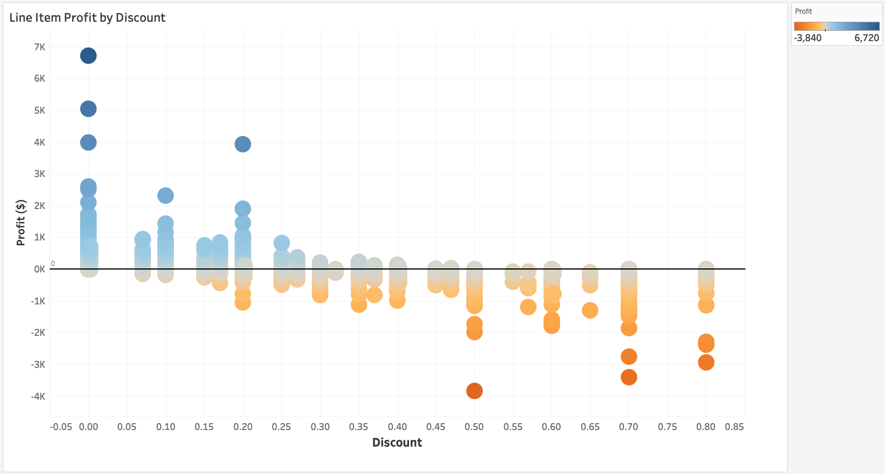
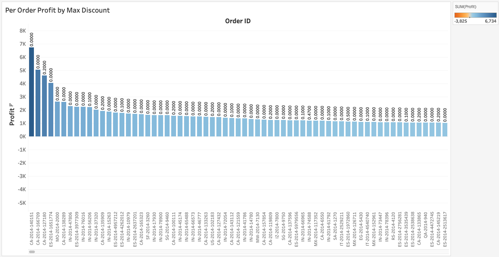
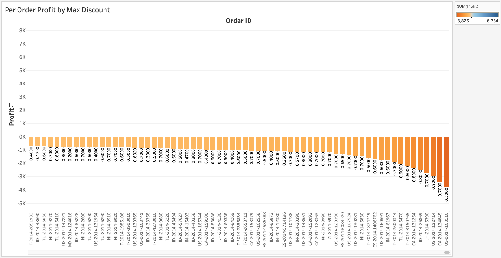

# Minimum Viable Product

#### Finding Potential Areas of Inefficiency or Lost Revenue/Negative Profit for Office Superstore

Using the Office Superstore worldwide sales data for all of 2014, exploration and aggregation in both Excel and Tableau has identified a fairly clear relationship between line item-specific Discount and Profit for a given customer order as show in this Tableau visualization:

As can be seen, Discounts above 25 or 30% lead to almost entirely negative profits. Thus a simple conclusion may be that such discounts are unjustifiably costly and should be discontinued. However, since the results in this plot reflect line items which may be just part of larger orders, one cannot tell whether or not the overall order was profitable. (It could be the case that such large discounts were given to successfully entice customers into completing an order which was still profitable overall).

The visulaizations below (views of the same chart, scrolled to its two extremes) shed some light on the situation by considering overall orders and the maximum discount (shown in the bar labels) applied to any line item in each order (not all items in a given order will necessarily be discounted by the same amount, or at all). 

This visualization (and a continued scrolling to the right) reveals that the most profitable orders almost always have small (20% or less) discounts applied. By contrast, the same visualization (scrolled all the way to the right) reveals that the most money-losing orders almost always have large discounts applied (often 50% or more), as seen below:

Additional exploration will be performed to determine if some of these money-losing orders are based on strategic pricing to accommodate certain high volume customers who are still profitable overall. If that is not the case, the probable recommendation will be to curtail the higher discounts (above 25 or 30%).
